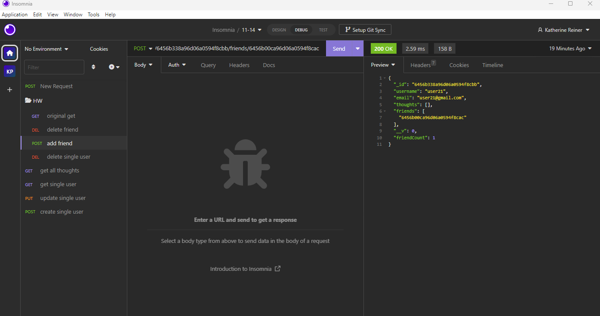
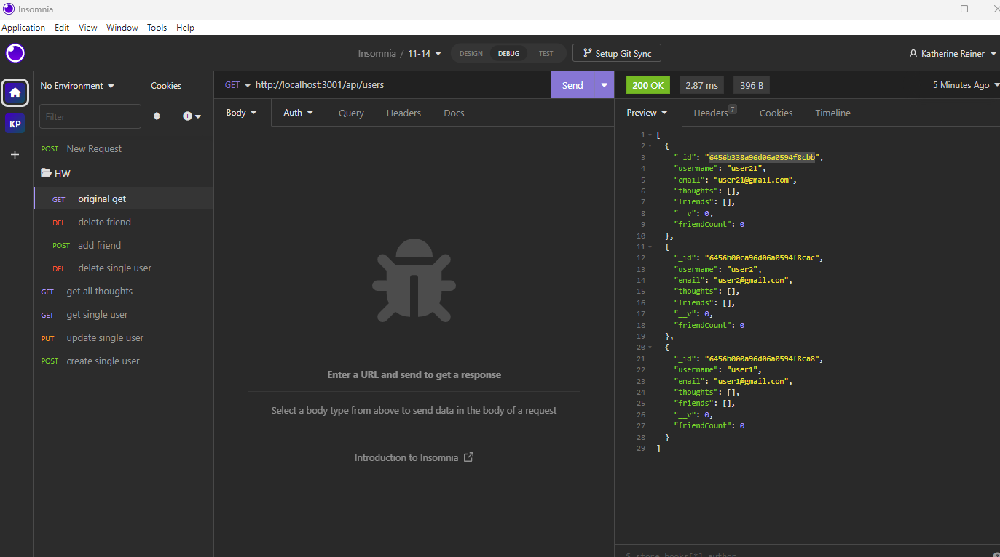

## SocialNetworkAPI

## Description
Use this API to create a new user, add friends, add thought, as well as create reactions! This tool uses mongoose and expressjs. This can be used in many applications such as building a social network with friends or any sitatution to define relationships and interact with other users!

## Visuals
Below are visuals of the backend 

## Installation
Start the installation process by running an NPM I and then NPM RUN START 

## Authors 
This was created by Katherine Reiner
